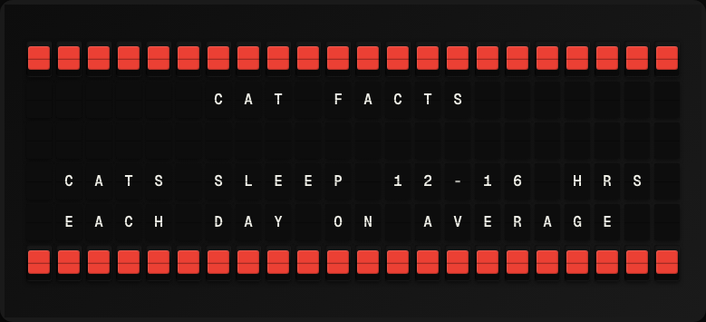

# Pet Facts Plugin

Display a random fun fact about cats or dogs.



**→ [Setup Guide](./docs/SETUP.md)**

## Overview

The Pet Facts plugin fetches a random cat or dog fact from free public APIs. Cat facts come from catfact.ninja; dog facts from dogapi.dog. Configure the animal type or let it randomize each refresh. No API key required.

## Template Variables

| Variable | Description | Example |
|---|---|---|
| `pet_facts.fact` | The pet fact | `Cats sleep 12-16 hours` |
| `pet_facts.animal` | The animal type (cat or dog) | `cat` |

## Example Templates

```
PET FACT
{{pet_facts.animal|upper}}

{{pet_facts.fact}}


```

## Configuration

| Setting | Name | Description | Required |
|---|---|---|---|
| `animal` | Animal | Which animal facts to show. | No |

## Features

- Random cat and dog facts
- Configurable animal type
- catfact.ninja API for cats
- dogapi.dog API for dogs
- No API key required

## Author

FiestaBoard Team
